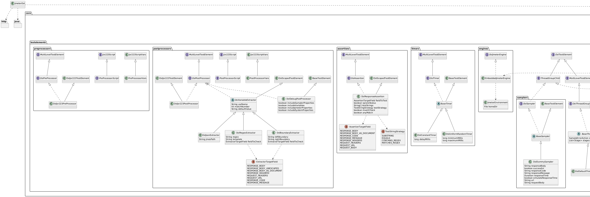

# JMeter DSL: Open Source Code-Based Performance Testing with Jmeter 

Performance testing is an essential part of software development. It helps ensure that your application can handle the expected load and provides a good user experience. But, it can be a complex and time-consuming task, especially for agile teams.

JMeter is a popular tool for performance testing. It provides a comprehensive set of features for testing web applications, including support for multiple protocols, a wide range of plugins, and a powerful scripting engine. But, it can be difficult to use, especially for developers who are not familiar with its UI.

This is where JMeter DSL comes in. JMeter DSL is an open-source project that allows you to write performance tests in Java. It provides a simple and intuitive API that makes it easy to create performance tests, even for developers who are not familiar with JMeter.

JMeter DSL is a great option for integrating performance testing into agile teams. It allows you to easily create and maintain performance tests in your source code repository. 

## The Jmeter DSL API
- The **TestPlan** method takes a single parameter, which is an instance of the **ThreadGroup** class.
- **ThreadGroup** is a class that represents a group of threads that will be used to execute the test. It has several methods called **TestElements** that allow you to configure the group, such as the number of threads, the ramp-up period, and the loop count.
- as we already know the jmeter Gui, the jmeter DSl has the following elements as samplers, timers, thread groups, assertions, preprocessors, postprocessors, etc...

## The Demo

### Demo Video

### System under test (SUT)

The SUT project is  a RESTful API in Java built using Spring Boot and Maven. First, create a new Spring Boot project using Maven and define the data model, which in this example is a simple "Product" entity. Then, implement the controller, service, and repository layers to handle CRUD operations for the Product entity.

The service layer acts as a bridge between the controller and the data access layer, and the repository interface handles the CRUD operations. The controller handles incoming HTTP requests and directs them to the appropriate service methods. Finally, set up the database configuration and other necessary configurations in the application.properties file.

To test the API, use tools like Postman or cURL to verify the endpoints for creating, reading, updating, and deleting product data. This tutorial provides a solid foundation for building more complex APIs that cater to real-world scenarios.

curl --location 'http://127.0.0.1:8000/api/products' \
--header 'Content-Type: application/json' \
--data '{
    "name": "banana",
    "description": "fruit",
    "price": 20.1
}'

source code for this repo is outlined here: 
### Jmeter dsl repo
the repo is a maven project with the following dependencies:

    - junit version: 5.11.0
    - jmeter-java-dsl version: 1.29
    - javafaker version: 1.0.2
    - jinjava version: 2.7.3

### Running the Test locally
1. bring up the system under test (SUT)  as per outlined in the repo
2. any performance test needs a monitoring stack so using docker-compose.yml bring up promethus/graphana stack to have a realtime monitoring of the test, sut and infra
2. run mvn test and check the report in target/report

## Conclusion

JMeter DSL brings a paradigm shift to the performance testing space. It offers a code-based approach that is more appealing to developers and test engineers alike. By moving away from the traditional GUI, JMeter DSL allows you to write and manage your performance tests in a more agile and developer-friendly way. Additionally, it integrates seamlessly with your CI/CD pipeline, making it easier to automate and manage your performance testing. To get started with JMeter DSL, SDETs should have a good understanding of how JMeter works, it also provides the competitive edge in comparison to other performance testing tools like locust, k6, and gatling.

